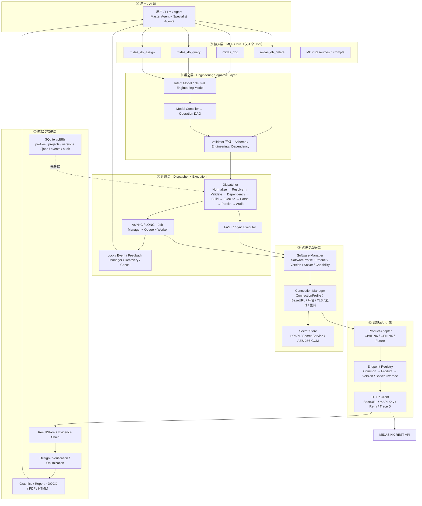
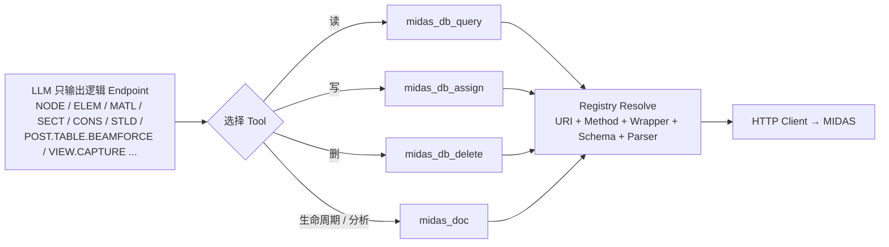
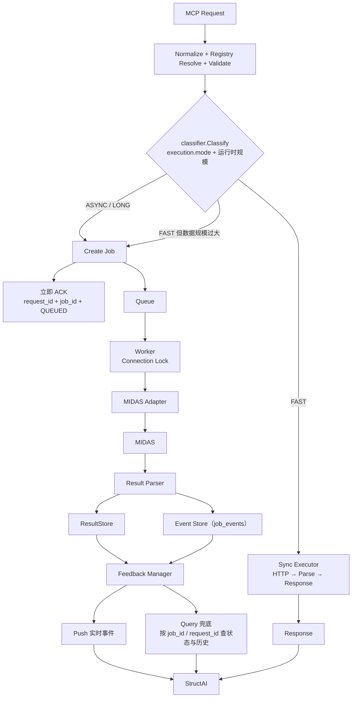
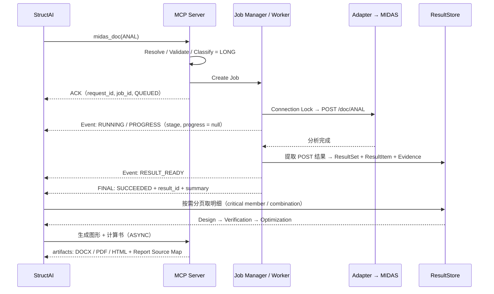

# StructAI｜多 MIDAS 一体化 MCP 项目框架图 v1.0

> 依据《StructAI 多 MIDAS 软件一体化 MCP 完整开发文档 V1.0》与《快速响应与实时反馈架构补充文档 V1.0》整理。
> 用途：架构审查。不引入文档之外的新设计；存在分歧或缺口的地方集中在第 9 节标注。

---

## 1. 总体分层框架图（Mermaid）



---

## 2. 总体分层框架图（ASCII 版）

```text
                       ┌────────────────────────────────────────────────┐
                       │  ① 用户 / LLM / Agent                          │
                       │     Master Agent + Model/Load/Analysis/Result/ │
                       │     Design/Verification/Report Agent           │
                       └───────────────────────┬────────────────────────┘
                                               │  MCP（stdio / http）
                       ┌───────────────────────▼────────────────────────┐
                       │  ② MCP Core —— 仅 4 个 Tool（长期不变）         │
                       │   midas_doc  midas_db_query                    │
                       │   midas_db_assign  midas_db_delete             │
                       │   + MCP Resources / Prompts                    │
                       └───────────────────────┬────────────────────────┘
                                               ▼
                       ┌────────────────────────────────────────────────┐
                       │  ③ Engineering Semantic Layer                  │
                       │   Intent → Neutral Engineering Model           │
                       │   Model Compiler → Operation DAG               │
                       │   Validator：Schema / Engineering / Dependency │
                       └───────────────────────┬────────────────────────┘
                                               ▼
                       ┌────────────────────────────────────────────────┐
                       │  ④ Dispatcher                                  │
                       │   Normalize→Resolve→Validate→Dependency→Build→ │
                       │   Execute→Parse→Persist→Audit→Return           │
                       └──────────┬──────────────────────────┬──────────┘
                                  │                          │
                    FAST（同步）  │                          │  ASYNC / LONG
                                  ▼                          ▼
                    ┌──────────────────────┐   ┌────────────────────────────┐
                    │ Sync Executor        │   │ Job Manager + Queue        │
                    │ （不进队列）          │   │ Worker · Connection Lock   │
                    └──────────┬───────────┘   │ Event · Feedback Manager   │
                               │               │ Recovery · Cancel          │
                               │               └──────────────┬─────────────┘
                               ▼                              ▼
                    ┌────────────────────────────────────────────────────┐
                    │  ⑤ Software Manager / Connection Manager / Secrets │
                    │   SoftwareProfile（是什么软件）                     │
                    │   ConnectionProfile（怎么连：BaseURL/环境/TLS/超时）│
                    │   Secret Store（MAPI-Key；DB 只存 api_key_ref）     │
                    └───────────────────────┬────────────────────────────┘
                                            ▼
                    ┌────────────────────────────────────────────────────┐
                    │  ⑥ Product Adapter：CIVIL NX / GEN NX / Future     │
                    │        ↓                                           │
                    │   Endpoint Registry：Common → Product → Version    │
                    │        ↓                                           │
                    │   HTTP Client：BaseURL + MAPI-Key + Retry + Trace  │
                    └───────────────────────┬────────────────────────────┘
                                            ▼
                                  MIDAS NX REST API
                                  DOC / DB / OPE / VIEW / POST

      ⑦ 数据与成果层（横向支撑）
      SQLite 元数据 + ResultStore / Evidence → Design → Verification
                    → Optimization → Graphics → Report（DOCX/PDF/HTML）→ Audit
```

---

## 3. MCP 四工具与路由

```text
midas_doc        → DOC 命名空间
                   NEW / OPEN / CLOSE / SAVE / SAVEAS / STAGAS /
                   IMPORT / IMPORTMXT / EXPORT / EXPORTMXT / ANAL
                   ANAL：risk = high，retryable = false

midas_db_query   → 所有“查询型”逻辑 Endpoint：DB / OPE / VIEW / POST
                   options：raw / include_schema / include_source / page / page_size
                   默认返回摘要 + 分页，不回全量原始数据

midas_db_assign  → 创建与修改
                   mode：create / update / upsert
                   options：validate_only / atomic / save_version
                   Assign 包装由 Dispatcher 按 Registry 自动生成（LLM 不写 wrapper）

midas_db_delete  → 删除，必须先做依赖检查
                   target_ids 必填（minItems = 1），禁止隐式“删除全部”
                   存在依赖时返回 DEPENDENCY_EXISTS + 依赖清单
```



---

## 4. 执行层：FAST / ASYNC / LONG 与反馈双通道



**Feedback 六层**：`ACK` → `STATE` → `PROGRESS` → `RESULT` → `ERROR` → `FINAL`

**三个 ID 关系**：

```text
Request(REQ-…) ──→ Job(JOB-…) ──→ Operation(OP-…) ──→ MIDAS API
```

**Job 生命周期**：

```text
CREATED → QUEUED → DISPATCHING → RUNNING → WAITING/PROGRESS → PARSING
        → RESULT_READY → SUCCEEDED

异常：RUNNING → FAILED
      RUNNING → CANCEL_REQUESTED → STOPPING → CANCELLED
      RUNNING → TIMEOUT_DETECTED → RECOVERY
      CONNECTION_LOST → 复查 MIDAS 进程 / API / Job → SUCCEEDED / FAILED / UNKNOWN
```

**执行模式与锁**：

| 模式 | 适用 | 是否进队列 | 锁 |
| --- | --- | --- | --- |
| FAST | 小查询、小规模 DB 读写、项目状态 | 否 | 无（或读并发） |
| ASYNC | 大批量建模、大规模结果提取、VIEW 截图、复杂 OPE | 是 | 同一 Connection 串行 |
| LONG | DOC.ANAL、模态、屈曲、地震、时程、非线性、施工阶段、设计、优化、计算书 | 是 | Connection 排他 + Project 锁 |

---

## 5. 工程语义层：意图 → 模型 → DAG → 校验

```text
用户自然语言 / 图纸 / PDF / CAD
        ↓
Intent Model（工程意图）
        ↓
Neutral Engineering Model
  Project · Geometry · Grid · Story · Node · Element · Material · Section
  Boundary · Load Case · Load · Load Combination · Analysis · Design · Results
        ↓
Model Compiler
        ↓
Operation DAG（自动解决依赖顺序）
  UNIT → STYP → MATL → SECT → NODE → ELEM
  NODE → ELEM
  CONS / STLD → BMLD → LCOM
  ANALYSIS CONTROL
        ↓
Validator
  Level 1 Schema      ：字段类型 / 必填
  Level 2 Engineering ：节点单元重复、断链、零长度、缺材料/截面/支座、楼层与单位异常
  Level 3 Dependency  ：MIDAS 数据引用关系
        ↓
Dispatcher → MCP Tool → Registry → MIDAS
```

**Project State Machine**：

```text
EMPTY → PROJECT_CREATED → MODEL_DRAFT → MODEL_VALIDATED → LOAD_READY
      → ANALYSIS_READY → ANALYZING → ANALYSIS_COMPLETE → DESIGNING
      → DESIGN_COMPLETE → VERIFICATION_COMPLETE → REPORT_BUILDING → FINAL

可回退到：MODEL_DRAFT / LOAD_READY / ANALYSIS_READY / DESIGNING
规则：回退不覆盖历史版本；每次重要修改生成新 Model Version
```

**Model Version 与证据链的绑定**：

```text
Report → Model Version → Analysis Job → ResultSet → ResultItem → Evidence ID
```

---

## 6. 数据层：SQLite 与 ResultStore / Evidence

```text
┌────────────── 配置与身份 ───────────────┐
│ software_profiles    产品身份（adapter / product / version / solver）│
│ connection_profiles  连接（base_url / api_key_ref / 环境 / TLS / 超时）│
│ projects             工程 + 软件绑定 + state + unit_system + code_profile│
│ project_versions     ModelVersion（hash / parent / change_summary）│
└────────────────────────────────────────┘
┌────────────── 执行与审计 ───────────────┐
│ jobs          当前状态（status / stage / progress / result_id）│
│ job_events    完整历史（RECEIVED → … → SUCCEEDED）│
│ api_audit     每次 MCP 调用（request/response hash，脱敏，禁存 Key）│
└────────────────────────────────────────┘
┌────────────── 结果与成果 ───────────────┐
│ result_sets   绑定 project / model_version / job / software / connection│
│ result_items  entity_type / entity_id / component / value / unit│
│ findings      统一问题对象（INFO / WARNING / REVIEW / ERROR / CRITICAL）│
│ figures       图 + model_version + result_set_id + evidence_ids│
│ reports / report_sources  计算书 + 章节来源映射│
└────────────────────────────────────────┘
```

**结果查询顺序（防止把全量结果塞进 Context）**：

```text
SUMMARY → MAX / MIN → CRITICAL → Specific Entity → Full Dataset（分页）
默认 page = 1，page_size = 100，最大 1000
```

**图与数字的绑定规则**：

```text
每张图必须保存：figure_id / model_version / result_set_id / evidence_ids / load_case / combination
计算书所有关键数字必须来自 ResultStore / DesignResult / VerificationResult
LLM 只做解释、归纳、组织文本，不允许凭记忆生成正式工程数字
```

---

## 7. 代码目录框架（Go）

```text
structai-mcp/
├── cmd/
│   └── structai-mcp/
│       └── main.go                 # --stdio / --http :8765
├── internal/
│   ├── mcp/                        # 4 Tool + Resources + Prompts
│   ├── config/
│   ├── software/                   # SoftwareProfile / Capability Matrix
│   ├── connection/                 # ConnectionProfile / Connection Test
│   ├── secrets/                    # DPAPI / Secret Service / AES-256-GCM
│   ├── adapter/                    # SoftwareAdapter 接口
│   │   ├── civil_nx/               # adapter / capabilities / registry / request / response
│   │   └── gen_nx/
│   ├── registry/                   # 加载 + 三层覆盖 + Resolver
│   ├── dispatcher/                 # Normalize → … → Return
│   ├── execution/                  # ← 补充文档新增
│   │   ├── classifier.go  queue.go  worker.go  scheduler.go
│   │   ├── lock.go  event.go  feedback.go  executor.go
│   │   └── recovery.go  cancel.go
│   ├── project/                    # Project / Version / State / Lock
│   ├── engineering/                # Neutral Model / Compiler / Validator
│   ├── analysis/                   # Planner / Job / Failure Analyzer
│   ├── result/                     # ResultStore / Normalize / Intelligence
│   ├── design/                     # Steel / Concrete / SRC / Seismic
│   ├── verification/
│   ├── graphics/
│   ├── report/                     # ReportModel / Template / Source Map
│   ├── workflow/
│   ├── audit/
│   └── storage/                    # SQLite / migrations
├── registry/
│   ├── common/
│   ├── products/{civil_nx,gen_nx}/
│   └── versions/{civil_nx,gen_nx}/
├── schema/                         # JSON Schema（按需加载）
├── templates/                      # 计算书模板
├── migrations/
├── tests/
└── docs/
```

**依赖方向（不可反向）**：

```text
internal/mcp → workflow → engineering → dispatcher → execution
             → adapter → registry → connection → httpclient → storage

规则：MCP 层不得反向依赖具体 CIVIL JSON；
      新增能力只加 Registry / Adapter / Semantic Layer，不加 MCP Tool
```

---

## 8. 端到端数据流（一句话 → 计算书）



```text
User Input → Intent Model → Engineering Model → Operation DAG → MCP → MIDAS
          → Raw Result → Normalized Result → Evidence → Design → Verification
          → Figure → Report → Audit
```

**Project Package 输出**：

```text
Project-001/
├── model/     final.mcb / final.json / final.mct
├── input/     project.json / loads.json / combinations.json
├── analysis/  analysis.json / modal.json / seismic.json / result/
├── design/    steel.json / concrete.json / verification.json
├── figures/   model_3d / model_plan / load / displacement / stress / moment / mode1 / drift
├── report/    StructAI_Calculation_Report.docx / .pdf / .html
└── audit/     operation_log.jsonl / model_versions.json / api_trace.jsonl / evidence.json
```

---

## 9. 关键不变量（审查基线）

| # | 不变量 | 依据 |
| --- | --- | --- |
| 1 | MCP Tool 恒为 4 个，新增 MIDAS 产品不加 Tool | 主文档 §4 / §145 |
| 2 | LLM 不生成 URL、不接触 MAPI-Key | §2 / §136 |
| 3 | Base URL 属于 ConnectionProfile，绝不硬编码 | §100 |
| 4 | MAPI-Key 只存在于 Secret Store；Schema / Prompt / 日志 / Audit 全脱敏 | §31 / §32 / §97 / §114 |
| 5 | Runtime Context 必含 Vendor / Product / Version / Solver / Connection / Endpoint | §13 |
| 6 | Project 必须绑定 software_id + connection_id，不凭空切换软件 | §37 / §98 |
| 7 | 删除必须依赖检查，禁止隐式删全部 | §8 / §48 / §97.2 |
| 8 | 分析 retryable = false，失败必须先诊断再决定是否重跑 | §62 / §102 / 补充 §26 |
| 9 | 所有重要模型修改必须版本化，回退不覆盖历史 | §40 / §41 / §42 |
| 10 | 所有长任务必须 Job 化；ACK 与最终结果严格分离 | 补充 §4 / §14 |
| 11 | Event 与 Job 必须持久化，Push 丢失可 Query 恢复 | 补充 §8 / §9 / §10 / §30 |
| 12 | 不允许伪造进度百分比；超时 / 断连不等于失败 | 补充 §7 / §27 / §28 |
| 13 | 计算书所有关键数字必须可追溯到 Result / Evidence | §58 / §133 |
| 14 | 每张图必须绑定 model_version + result_set_id + evidence_ids | §134 |
| 15 | 发布前状态必须满足 VALIDATED → ANALYSIS_COMPLETE → DESIGN_COMPLETE → VERIFICATION_COMPLETE | §132 |

---

## 10. 待审查确认点（文档之间存在空白或冲突，需你裁决）

| # | 问题 | 现状 | 影响 |
| --- | --- | --- | --- |
| Q1 | **Job 查询入口缺失**：补充文档要求 StructAI 可按 `job_id` / `request_id` 查询状态与历史 Event，但主文档规定只有 4 个 Tool，且未定义该入口 | 可能是 MCP Resources（`structai://job/{id}`）承载，或需要一个第 5 个工具 | 直接决定 MCP 接口形态，编码前必须定 |
| Q2 | **`job_events` 表结构冲突**：主文档 §83（`id INTEGER AUTOINCREMENT`，无 request_id / operation_id）与补充文档 §9（`id TEXT PRIMARY KEY`，含 request_id / operation_id / stage）不一致 | 需以补充文档为准并回写主文档，或明确版本关系 | 影响 migrations 与恢复逻辑 |
| Q3 | **Registry 覆盖范围**：§111 第一批只有 21 个逻辑 Endpoint，§123 要求最终逐二级页面全量录入官方手册 | 范围差 1–2 个数量级 | 决定第一阶段工期与测试矩阵规模 |
| Q4 | **两级锁的关系**：主文档 ProjectLock（WRITE/ANALYSIS/DESIGN/REPORT/PUBLISH）与补充文档 Connection Lock（同一 Connection 单 Worker） | 未说明两者的获取顺序与死锁规避 | 并发正确性 |
| Q5 | **WebUI 归属**：§34–§36 定义了多软件管理 / 添加软件 / 连接测试页面，但未说明它是 MCP 内置 HTTP 服务还是独立前端 | `--http :8765` 用途未明确 | 影响进程与部署形态 |
| Q6 | **自动识别软件**（§130）需要 Product Info 探测的具体 Endpoint | 未在 Registry 第一批列出 | 影响"添加软件"流程 |
| Q7 | **Neutral Model 的持久化格式**：§19 / §45 定义模型结构，但未定义落盘 schema（final.json 的 schema_ref） | 只提到 `model/final.json` | 影响跨软件迁移与兼容性检查 |

---

## 11. 阶段验收与框架图的对应关系

```text
第一阶段：② MCP Core + ⑤ 软件连接层 + ⑥ Registry/Dispatcher 最小闭环
          → 真实 NODE 写入 + 读取 + Audit
第二阶段：③ 语义层 + Operation DAG 打通 NODE/ELEM/MATL/SECT/CONS/STLD/BMLD/LCOM
第三阶段：④ 执行层 LONG 路径 + POST/VIEW → 真实静力/模态/P-Delta 与结果提取
第四阶段：⑦ Design / Verification / Optimization
第五阶段：⑦ Graphics / Report → 计算书含 9 类图 + DOCX/PDF/HTML
```

> 本框架图仅为架构审查用，未新增主文档与补充文档之外的机制；第 10 节问题确认后需回写两份文档再进入编码。
